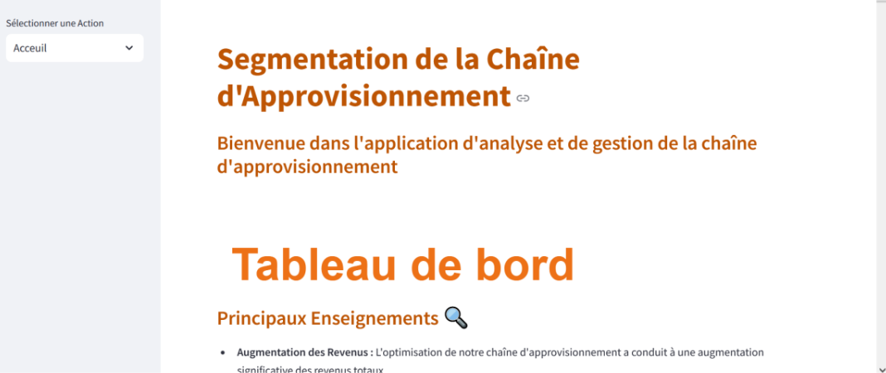
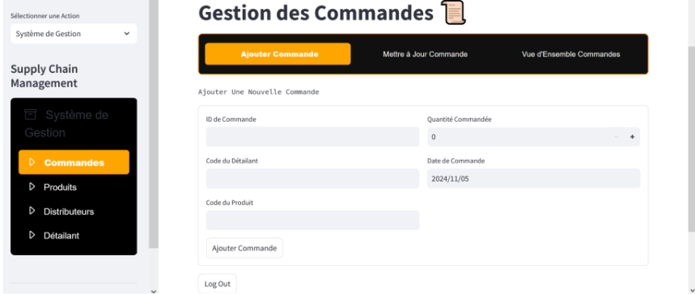
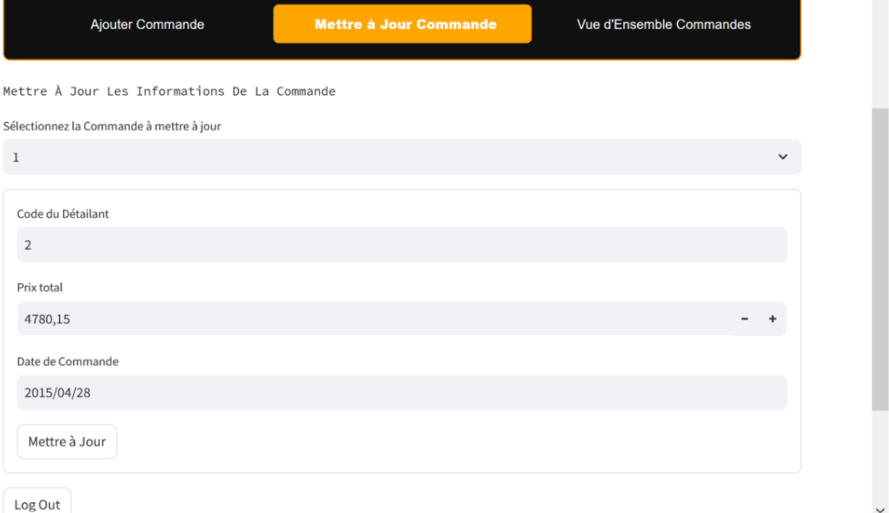
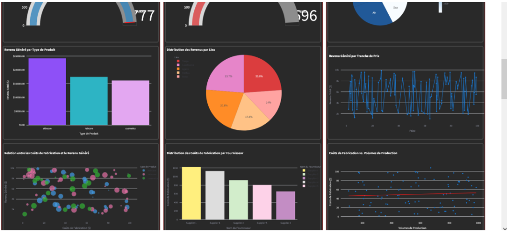

# SupplyChain analysis and management
Supply chain management is a fundamental element in optimizing organizational performance. Faced with expanding global markets and increasingly complex structures, it has become essential for companies to integrate and optimize all their processes, from purchasing to delivery. In this context, supply chain analysis and management tools play a crucial role in understanding performance, identifying areas for improvement and guiding strategic decisions.
This application provides an overview of the key benefits of supply chain optimization, including significant revenue increases, shorter lead times and substantial cost savings.

This is the link of the app : https://supplychain-analysis-and-management-meskine-fz-badadaih-benmbrk.streamlit.app/
Username: admin
Password: admin123

